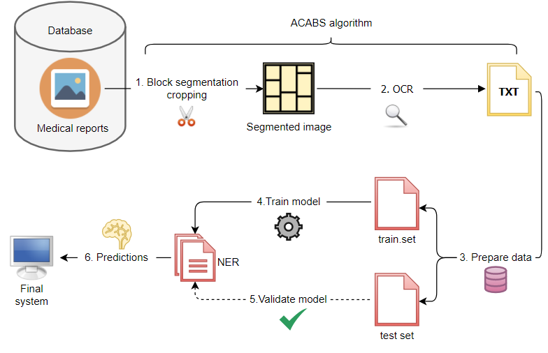
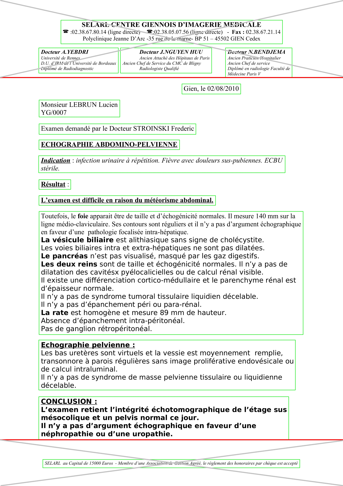
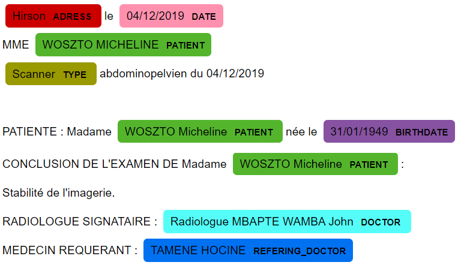

# Intelligent data extraction from medical reports

From a medical repport image (in french) the system extract the following informations : 

- the patient’s name, and date of birth
- the date of the medical intervention
- the type of medical intervention (for example : radiology)
- the name of the doctor who performed the medical
intervention
- the address of the intervention
- the referring doctor

The system work as follow : 

<section align='center'>
    
</section>

## Requirements

- Tesseract 5.0.0
- pytesseract 0.3.8
- NumPy 1.19.5
- OpenCV python 4.5.1.48
- SpaCy 3.2.0


## Image segmentation and text extraction

The image segmentation and text extraction from image of medical repport is done using the algorithm ACABS (Automatic Cropper and Block Segmenter). For more details about ACABS see the [repport](../blob/master/Intelligent_data_extraction_from_medical_reports.pdf).

### ACABS

ACABS first detect and segment the image into block of text. It then select the relevent block text and remove the report's header and footer. Finally the text is extracted from the medical image report thanks to OCR.

```python
from acabs import ACABS

#usage on an image
text = ACABS(path_to_image)

#usage on a folder of image
import os

texts = ''
_, _, filenames = next(os.walk(path_to_folder))
os.chdir(path_to_folder)
for file in filenames:
    text = ACABS(file)
        with open('path_to_save_text/' + file.split('.')[0] + '.txt', 'w') as f:
        f.write(text)

    texts = texts + '\jump=================== New repport : ' + file + ' ===================\jump' + text
```
Visual output of ACABS segmentation: 

<section align='center'>
    
</section>

## Extraction of key information

After using ACABS to extract the text, the data need to be annotated (like [annotated_text.json](annotated_text.json). In order to speed up the annotation use a software like  [ner-annotator](https://github.com/tecoholic/ner-annotator).

Transform the data into a spacy like format using [transform_data.py](transform_data.py).

### Train a model

Use [config.cfg](config.cfg) to customize the model.

- Verify the data : 
```python -m spacy debug data ./config.cfg --paths.train ./train.spacy --paths.dev ./dev.spacy```

- Train the model : ```python -m spacy train config.cfg --output ./output --paths.train ./train.spacy --paths.dev ../dev.spacy --gpu-id 1```

- Evaluate the model : ```python3 -m spacy evaluate ./output/model-best ./dev.spacy```

### Use a model

See [predictions.ipynb](predictions.ipynb)

<section align='center'>
    
</section>
